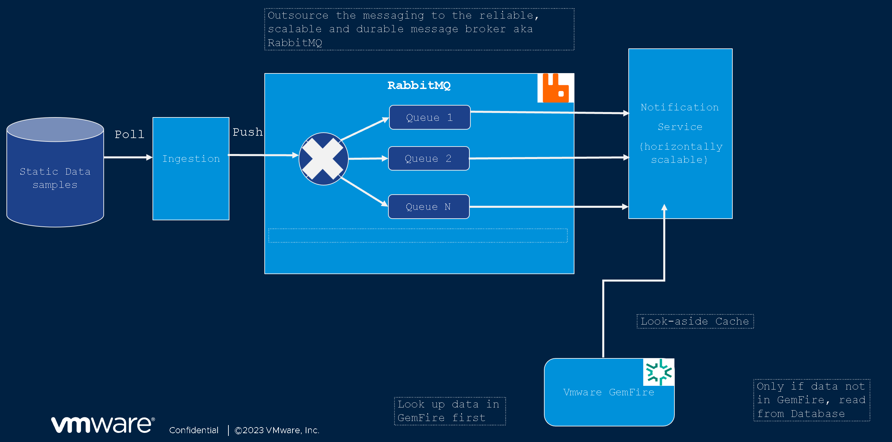

## What this is all about
This code demonstrates best practices of reliable messaging and caching by creating two Kubernetes-ready microservices written in [Spring Boot](https://spring.io/projects/spring-boot/) `3.2.1`:
* The `transaction-ingestion-service`: using the [RabbitMQ](https://tanzu.vmware.com/rabbitmq) to publish transactions
* The  `notification-service`: scalable Kubernetes stateful set of multiple replicas consuming the transactions from the [RabbitMQ message broker](https://tanzu.vmware.com/rabbitmq) and matching its data with the customer data stored in [VMware GemFire in-memory data grid](https://www.vmware.com/au/products/gemfire.html). The idea is to spin a replica which is consuming from a dedicated [RabbitMQ queue](https://www.rabbitmq.com/queues.html).

## Architecture


## Configuration
Some properties (e.g., the RabbitMQ or GemFire connection string and credentials) require configuration.
* When run locally, the configuration properties are taken from `application-default.properties|yaml` file.
* When run in Kubernetes, the Helm deploys [configmaps](https://kubernetes.io/docs/concepts/configuration/configmap/) containing the configuration, see the `k8s/helm/chart/[chart-name]/templates/configmap.yaml` file. The app then is running under the `kubernetes` profile and reads the configuraion from the configmaps.

## Prerequisites

### Create a Kubernetes cluster
Use a distribution of your choice. e.g. [kind](https://kind.sigs.k8s.io/) if for development purposes.
On the cluster, create and configure:
* [Local registry](https://kind.sigs.k8s.io/docs/user/local-registry/), or use an existing private registry.
* [Load balancer](https://kind.sigs.k8s.io/docs/user/loadbalancer/)

### Install Helm
Helm is a package manager for Kuberntes used to package our microservices.
Follow the [guide](https://helm.sh/docs/intro/install/)

### Install RabbitMQ
Follow the [guide](https://docs.vmware.com/en/VMware-RabbitMQ-for-Kubernetes/1/rmq/installation.html)

### Install GemFire
* Install the [Kubernetes GemFire operator](https://docs.vmware.com/en/VMware-GemFire-for-Kubernetes/2.3/gf-k8s/install.html)
* Create a [GemFire cluster](https://docs.vmware.com/en/VMware-GemFire-for-Kubernetes/2.3/gf-k8s/create-and-delete.html)

### Install JDK
Used to build the artefacts from the source code.

### Enable the RabbitMQ Consistent Hash Plugin
The [Consistent Hash Exchange](https://github.com/rabbitmq/rabbitmq-consistent-hash-exchange) is used to distribute workload to multiple queues backed by mutiple CPU cores.

To enable the plugin, assuming the k8s rabbitmq namespace is `rabbitmq-system`, and the number of RabbitMQ pods is `3`:
```
kubectl -n rabbitmq-system exec -it tanzu-rabbitmq-server-0 -- rabbitmq-plugins enable rabbitmq_consistent_hash_exchange
kubectl -n rabbitmq-system exec -it tanzu-rabbitmq-server-1 -- rabbitmq-plugins enable rabbitmq_consistent_hash_exchange
kubectl -n rabbitmq-system exec -it tanzu-rabbitmq-server-2 -- rabbitmq-plugins enable rabbitmq_consistent_hash_exchange
```

## Running Services locally
From the CLI or the IDE, do:
#### Transaction Ingestion Service
```
./gradlew :transaction-ingestion-service:bootRun
```
#### Notification Service
##### Obtain Certificates
First, copy the GemFire certifcates from Kubernetes to the `certs` folder underneath the `notification-service` as described in the [Obtain Certificates](https://docs.vmware.com/en/VMware-GemFire-for-Kubernetes/2.3/gf-k8s/off_platform.html) section.

For example, if the k8s namespace is `tanzu-gemfire` and the gemfire cluster is named `my-gemfire-cluster`, it will be:
```
cd ./notification-service
mkdir certs

kubectl -n tanzu-gemfire get secret my-gemfire-cluster-cert -o=jsonpath='{.data.password}' | base64 --decode > ./certs/password
kubectl -n tanzu-gemfire get secret my-gemfire-cluster-cert -o=jsonpath='{.data.keystore\.p12}' | base64 --decode > ./certs/keystore.p12
kubectl -n tanzu-gemfire get secret my-gemfire-cluster-cert -o=jsonpath='{.data.truststore\.p12}' | base64 --decode > ./certs/truststore.p12
```
##### Run
```
./gradlew :notification-service:bootRun
```

## Building the Helm charts and deploying the microservices to Kubernetes
Each microservice has a corresponding `build-and-deploy-k8s.sh` script file.
You may need to adjust the following variables:
* `namespace`: the k8s namespace used to deploy the artefacts
* `registry`: your local or private [Docker registry](https://docs.docker.com/registry/) URL.
You also need to edit the `k8s/helm/chart/[service-name]/templates/configmap.yaml` file to have correct connection strings and certificates (see the section above under `Running Services Locally`)

## Appendix
### Connecting to GemFire on K8s
```
# connect to a locator pod:
kubectl -n YOUR-GEMFIRE-NAMESPACE exec -it YOUR-GEMFIRE-CLUSTER-locator-0 -- gfsh

# type in gfsh:
connect --locator=YOUR-GEMFIRE-CLUSTER-locator-0.YOUR-GEMFIRE-CLUSTER-locator.YOUR-GEMFIRE-NAMESPACE.svc.cluster.local[10334] --security-properties-file=/security/gfsecurity.properties

```
For example, if the k8s namespace is `tanzu-gemfire`, and the gemfire cluster is named `gemfire-cluster`, it is:
```
# connect to a locator pod:
kubectl -n tanzu-gemfire exec -it gemfire-cluster-locator-0 -- gfsh

# type in gfsh:
connect --locator=gemfire-cluster-locator-0.gemfire-cluster-locator.tanzu-gemfire.svc.cluster.local[10334] --security-properties-file=/security/gfsecurity.properties
```

### Running microservices in Docker
Example:
```
# build
docker build -t transaction-ingestion-service .

# run
docker run --rm -p8081:8080 transaction-ingestion-service
```
