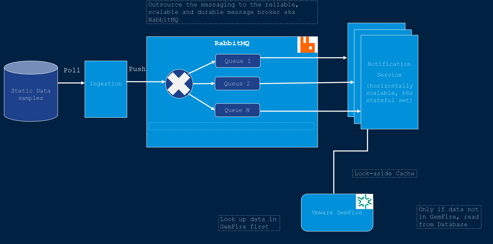

## Docker
```
# build
docker build -t transaction-ingestion-service .

# run (in Docker)
docker run --rm -p8081:8080 transaction-ingestion-service
```
## Prerequisites

### Install RabbitMQ

### Install GemFire

### Enable RabbitMQ Consistent Hash Plugin
```
kubectl -n rabbitmq-system exec -it tanzu-rabbitmq-server-0 -- rabbitmq-plugins enable rabbitmq_consistent_hash_exchange
kubectl -n rabbitmq-system exec -it tanzu-rabbitmq-server-1 -- rabbitmq-plugins enable rabbitmq_consistent_hash_exchange
kubectl -n rabbitmq-system exec -it tanzu-rabbitmq-server-2 -- rabbitmq-plugins enable rabbitmq_consistent_hash_exchange
```

### Running locally
From the CLI or the IDE, do:
#### Transaction Ingestion Service
```
./gradlew :transaction-ingestion-service:bootRun
```
#### Notification Service
```
./gradlew :notification-service:bootRun
```

## Connecting to GemFire on K8s
```
kubectl -n tanzu-gemfire exec -it gemfire-cluster-locator-0 -- gfsh

# type in gfsh:
connect --locator=gemfire-cluster-locator-0.gemfire-cluster-locator.tanzu-gemfire.svc.cluster.local[10334] --security-properties-file=/security/gfsecurity.properties
```
## Creating a Helm Chart
### Health Endpoints
```
          livenessProbe:
            httpGet:
              path: /actuator/health/liveness
              port: http
          readinessProbe:
            httpGet:
              path: /actuator/health/readiness
              port: http
```
### .helmignore
```
deploy.sh
*.tgz
```
### Chart.yaml
```
appVersion: "latest"
```
### Values.yaml
```
image:
  repository: localhost:5001/weather-web-server
  name: weather-web-server
  pullPolicy: Always
  # Overrides the image tag whose default is the chart appVersion.
  tag: "latest"
```

```
service:
  enabled: true
  type: LoadBalancer
  port: 80
  targetPort: 8080
  protocol: TCP
```

```
ingress:
  enabled: false
  annotations:
      kubernetes.io/ingress.class: nginx
      kubernetes.io/tls-acme: "true"
  hosts:
    - host: weather-web-server.local
      paths:
        - path: /
          pathType: Prefix
          backend:
            serviceName: weather-web-server-svc
            servicePort: 80
```
